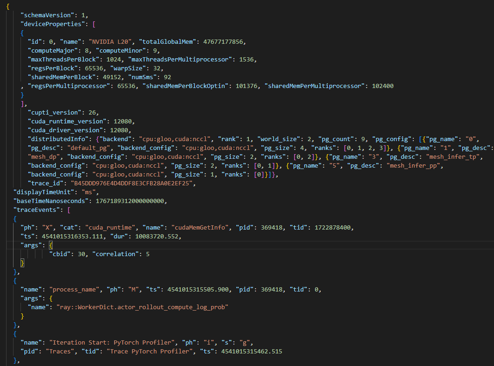
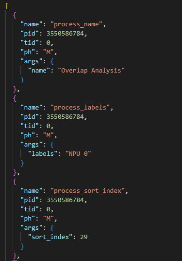

# RL-Insight - 数据文件目录结构

## 一、采集Torch Profiling 数据目录结构

```
<profile-data-path>/
└── <role>/
    └── prof_*.json.gz
```
### 数据解析文件 prof_*.json.gz，解析文件缺少字段见解析日志warning，解析文件内容示例：



## 二、采集Mstx Profiling 数据目录结构

```
<profile-data-path>/
└── <role>/
    └── *_ascend_pt/
        |── profiler_info_*.json
        └── ASCEND_PROFILER_OUTPUT/
            └── trace_view.json
```
### 数据解析文件 trace_view.json，解析文件内容必须包含"ph": "M"，且"name": "Overlap Analysis"对应"pid"的数据，缺少字段见解析日志warning，解析文件内容示例：


